# Отримання доступу до інтерфейсу ArgoCD

## Покрокова інструкція зі встановлення та отримання доступу до інтерфейсу ArgoCD

### Крок 1: Створення Kubernetes кластера за допомогою k3d
1. Відкрийте термінал або командний рядок.
2. Введіть команду для створення локального Kubernetes кластера з використанням k3d:
   ```bash
   k3d cluster create argocd-asciiartify
   ```
3. Перевірте стан кластера
   ```bash
   kubectl cluster-info
   kubectl get all -A
   ```
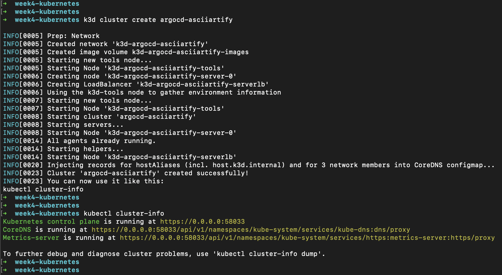
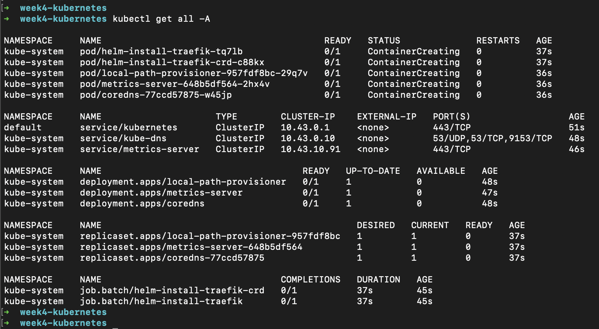


### Крок 2: Встановлення ArgoCD
4. Створіть неймспейс argocd в кластері
  ```bash
  kubectl create namespace argocd
  kubectl get ns
  ```
5. Встановіть ArgoCD, використовуючи kubectl, в створений неймспейс:
  ```bash
  kubectl apply -n argocd -f https://raw.githubusercontent.com/argoproj/argo-cd/stable/manifests/install.yaml
  ```
  Перевірте стан кластера та подів в неймспейсі argocd:
  ```bash
  kubectl get all -n argocd
  kubectl get pod -n argocd -w
  ```
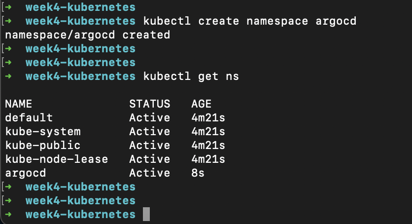
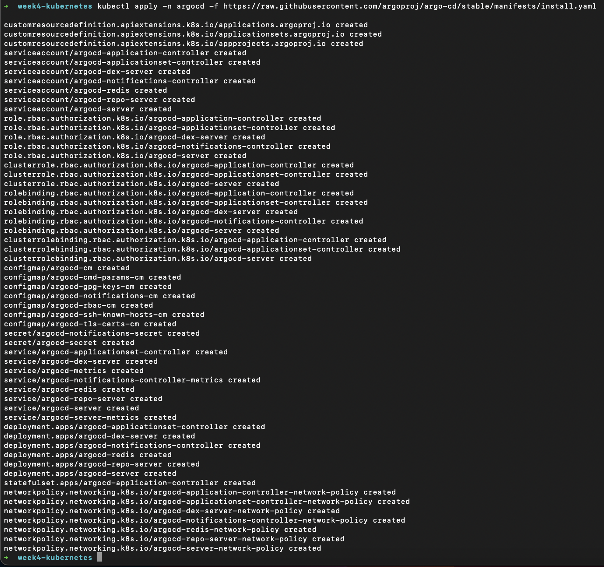
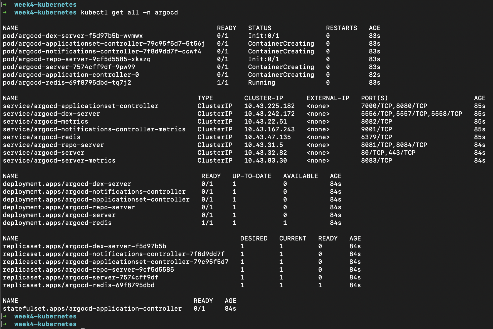
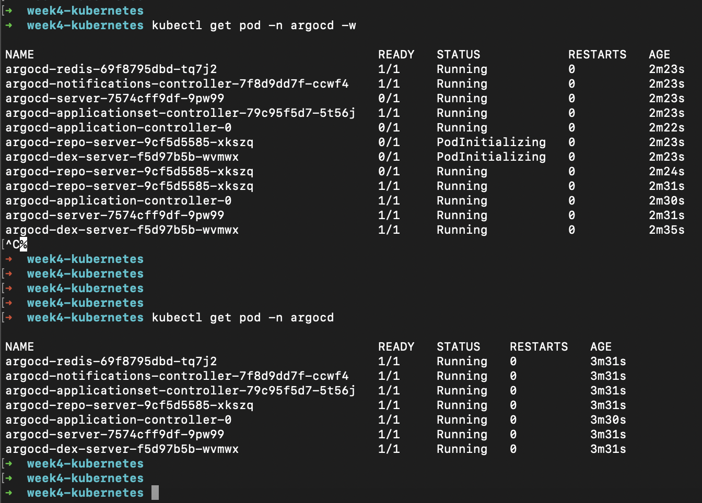

### Крок 3: Доступ до веб-інтерфейсу ArgoCD
7. Скористайтесь Port Forwarding для отримання доступу до веб-інтерфейсу, в ArgoCD використовується https, тому 443 порт:
  ```bash
  kubectl port-forward svc/argocd-server -n argocd 8080:443
   ```
  де argocd-server - це сервіс що знаходиться в неймспейсі argocd.
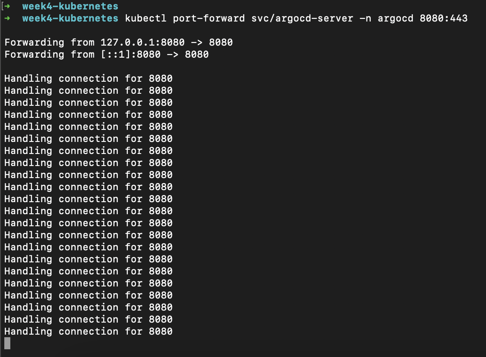

6. Отримайте пароль для входу у веб-інтерфейс ArgoCD (в окремій вкладці термінала):
  ```bash
  kubectl -n argocd get secret argocd-initial-admin-secret -o jsonpath="{.data.password}" | base64 -d
  ```
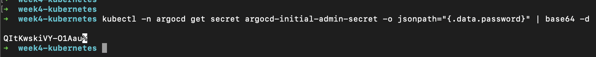

### Крок 4: Відкриття веб-інтерфейсу
7. Відкрийте веб-браузер та перейдіть за наступним посиланням: http://localhost:8080/, в локальному оточенні вкажіть браузеру що довіряєте ресурсу, бо спочатку отримаєте помилку сертифікату (в продакшені треба встановлювати сертифікати окремо).
8. Введіть ім'я користувача (за замовчуванням `admin`) та пароль, отриманий на кроці 6.
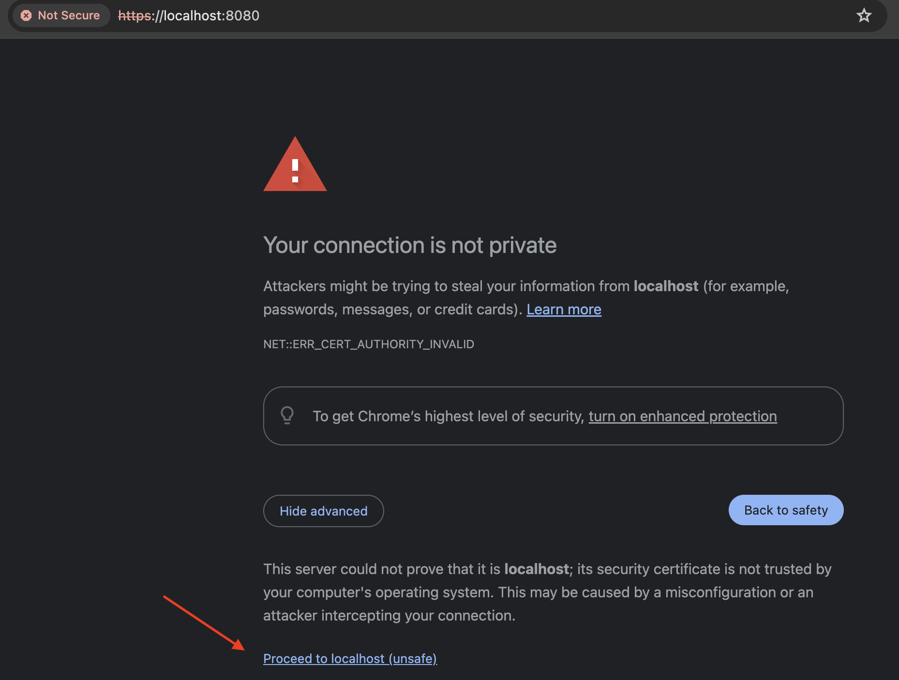
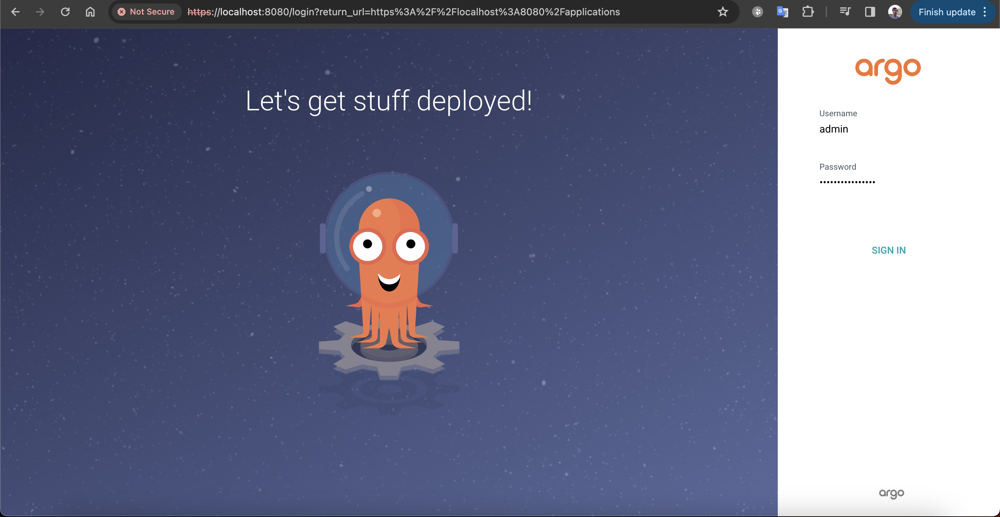

### Крок 5: Використання ArgoCD
9. Тепер ви увійшли до веб-інтерфейсу ArgoCD. Ви можете почати розглядати, додавати та керувати вашими додатками Kubernetes.
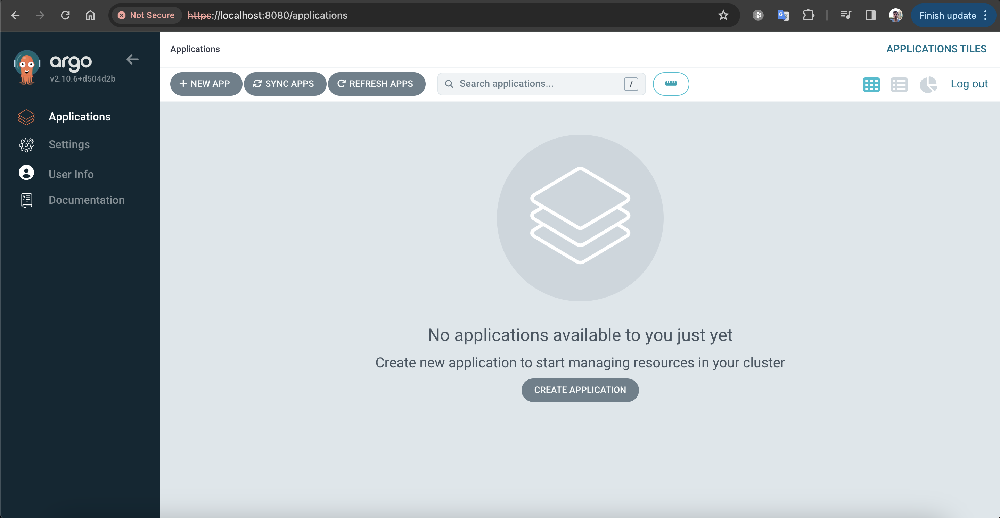
