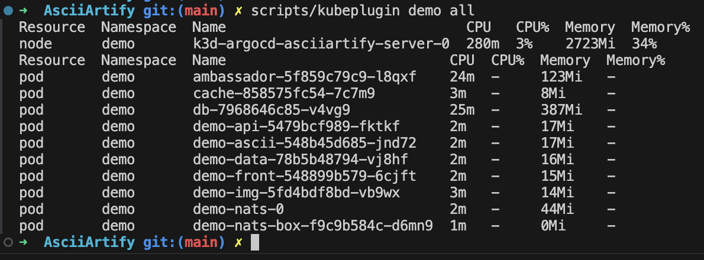
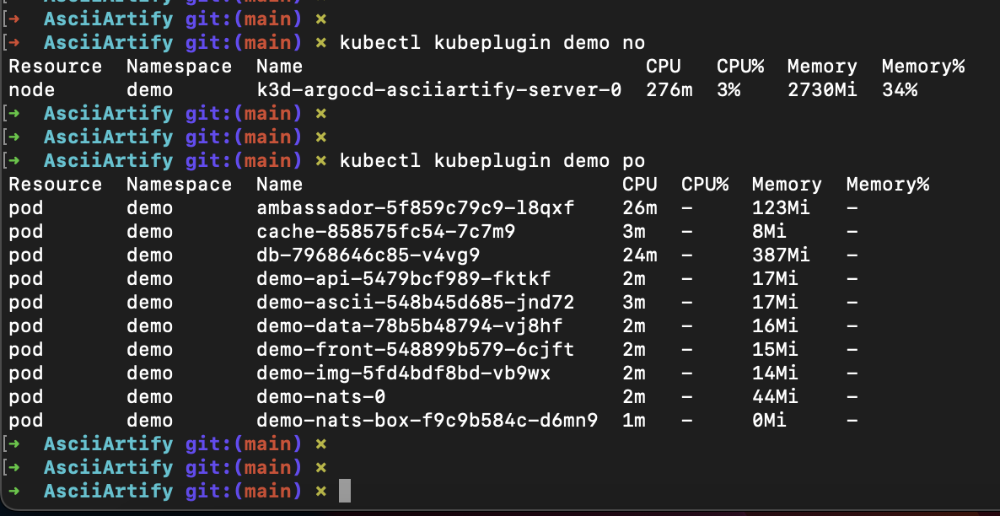

## Використання скрипта `kubeplugin`

Цей скрипт дозволяє отримати статистику використання ресурсів в кластері Kubernetes для певного простору імен та типу ресурсу.

### Параметри командного рядка:

1. **Перший аргумент (обов'язковий):** Неймспейс - ідентифікатор, який вказує на область імен, в якій ви хочете отримати статистику. Наприклад, `default` або `production`.

2. **Другий аргумент (обов'язковий):** Тип ресурсу - тип ресурсу Kubernetes, для якого ви хочете отримати статистику. Можливі значення: `pod` або `po` для отримання статистики по кількості та використанню ресурсів подів, `node` або `no` для статистики по вузлах, або `all`, щоб отримати статистику для всіх доступних ресурсів.

### Приклади використання:

1. Отримати статистику для певного неймспейсу та типу ресурсу:
```bash
   ./kubeplugin my-namespace pod
```
Ця команда виведе статистику використання ресурсів для усіх подів в неймспейсі my-namespace.

2. Отримати статистику для вузлів у певному неймспейсі:
```bash
./kubeplugin my-namespace node
```
Ця команда виведе статистику використання ресурсів для усіх вузлів в неймспейсі my-namespace.

3. Отримати статистику для всіх доступних ресурсів в певному неймспейсі:
```bash
./kubeplugin my-namespace all
```
Ця команда виведе статистику використання ресурсів для усіх доступних ресурсів (подів та вузлів) в неймспейсі my-namespace.

### Формат виведення:
Результат виконання скрипта виводиться у вигляді таблиці, яка містить наступні стовпці:

- Resource: Тип ресурсу (pod або node).
- Namespace: Неймспейс, до якого належить ресурс.
- Name: Назва ресурсу (ім'я поду або вузла).
- CPU: Кількість використаного CPU (в ядрі або міліядрі).
- CPU%: Відсоток використання CPU.
- Memory: Кількість використаної пам'яті (в байтах).
- Memory%: Відсоток використання пам'яті.




## Використання скрипта `kubeplugin` як плагіну для kubectl

Скрипт `kubeplugin` можна використовувати як плагін для інтерфейсу командного рядка `kubectl`, що дозволяє зручно отримувати статистику використання ресурсів Kubernetes без необхідності запускати скрипт окремо.

### Встановлення як плагіну для kubectl

1. Спочатку скопіюйте скрипт `kubeplugin` в один з каталогів, перерахованих у вашій змінній середовища `PATH`. Наприклад, `/usr/local/bin` або `~/bin`. Кінцевий файл повинен мати префікс `kubectl-`, щоб kubectl зміг розпізнати його як свій плагін, напр.
```bash
cp scripts/kubeplugin /usr/local/bin/kubectl-kubeplugin  
```

2. Переконайтеся, що скрипт має права на виконання. Якщо цього немає, виконайте команду `chmod +X path/to/kubectl-kubeplugin`.

#### Використання як плагіну для kubectl

Після встановлення ви можете викликати скрипт `kubeplugin` як плагін для `kubectl` таким чином:

```bash
kubectl kubeplugin <namespace> <resource-type>
```


